# System Functional Design

Tài liệu này tóm tắt các khối chức năng chính của backend IT Task Manager (`src/routes`, `src/controllers`, `src/services`) và mô tả chúng bằng các biểu đồ Use Case & Sequence PlantUML để hỗ trợ quá trình phân tích thiết kế hệ thống.

---

## 1. Authentication & Profile Management
**Scope:** Đăng ký/đăng nhập, làm mới/thu hồi phiên JWT, cập nhật hồ sơ và quy trình reset mật khẩu (xem `src/routes/auth/authRoute.js`).

**Key Endpoints:**
- `POST /auth/register`, `POST /auth/login`, `POST /auth/logout`, `POST /auth/token/refresh`
- `GET /auth/me`, `PUT /auth/me`, `PUT /auth/me/password`
- `POST /auth/password/reset-requests`, `POST /auth/password/reset-confirmations`

### Use Case Diagram
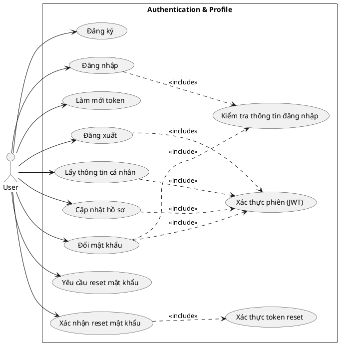

### Sequence Diagram – User Login
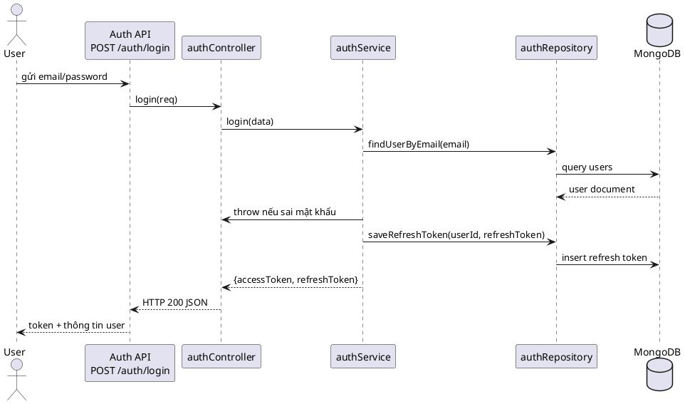

---

## 2. Project & Member Management
**Scope:** CRUD dự án, xem danh sách/chi tiết, quản lý thành viên, vai trò và thiết lập Free Mode (`src/routes/home/projectRoute.js`).

**Key Endpoints:**
- `POST /home/projects`, `GET /home/projects`, `GET /home/projects/{id}`
- `PUT /home/projects/{id}`, `DELETE /home/projects/{id}`
- `GET /home/projects/{id}/members`, `DELETE /home/projects/{id}/members/{userId}`
- `PUT /home/projects/{id}/members/roles`, `PATCH /home/projects/{id}/settings`
- `GET /home/projects/{id}/roles`

### Use Case Diagram
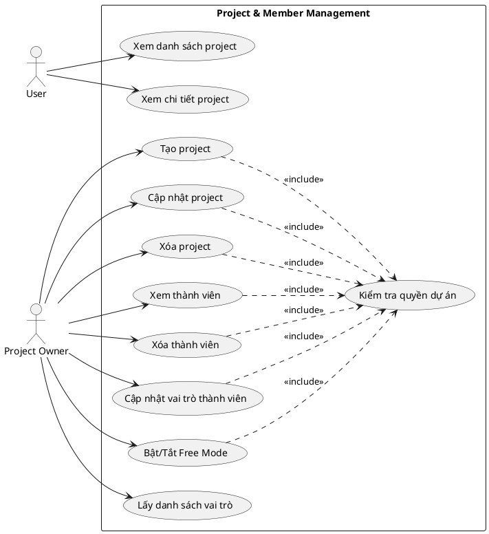

### Sequence Diagram – Update Member Role
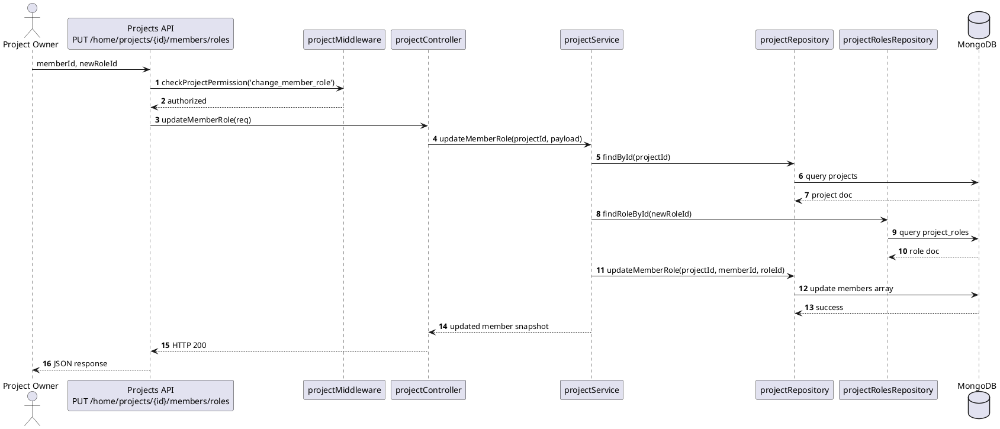

---

## 3. Column & Task Board
**Scope:** Quản lý cột và nhiệm vụ kiểu Kanban (xem `src/routes/home/columnRouter.js` và `src/routes/home/taskRoute.js`).

**Key Endpoints:**
- Columns: `GET /home/columns/projects/{projectId}`, `POST /home/columns/projects/{projectId}`, `GET /home/columns/{id}`, `PUT /home/columns/{id}`, `DELETE /home/columns/{id}`, `PATCH /home/columns/cards/move`
- Tasks: `GET /home/tasks`, `POST /home/tasks/projects/{projectId}`, `GET /home/tasks/projects/{projectId}/{taskId}`, `PUT /home/tasks/projects/{projectId}/{taskId}`, `DELETE ...`, `POST/DELETE /assignments`, `PATCH /status`

### Use Case Diagram
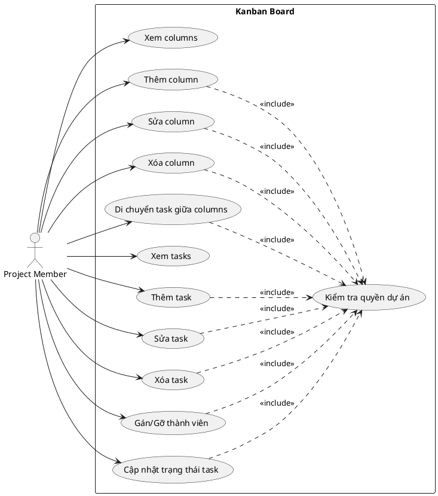

### Sequence Diagram – Move Task Between Columns
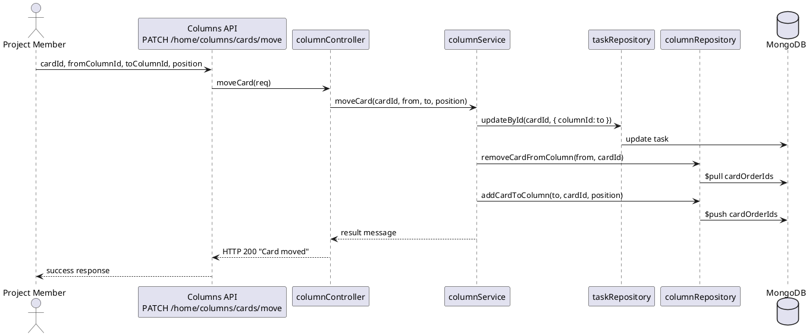

---

## 4. Invite & Access Control
**Scope:** Lời mời tham gia dự án, link cố định, thao tác chấp nhận/từ chối và yêu cầu truy cập project riêng tư (`src/routes/home/inviteRoute.js`, `src/routes/home/accessRequestRoute.js`).

**Key Endpoints:**
- Invites: `GET /home/invites/me`, `GET /home/invites/projects/{projectId}/permanent-link`, `GET /home/invites/projects/{projectId}/emails`, `POST /home/invites/projects/{projectId}`, `PATCH /home/invites/{inviteId}/accept|reject`, `DELETE /home/invites/{inviteId}`, `GET /home/invites/token/{token}`
- Access Requests: `GET /home/access-requests/me`, `POST /home/access-requests/projects/{projectId}`, `GET /home/access-requests/projects/{projectId}`, `PATCH /home/access-requests/{requestId}/accept|reject`

### Use Case Diagram
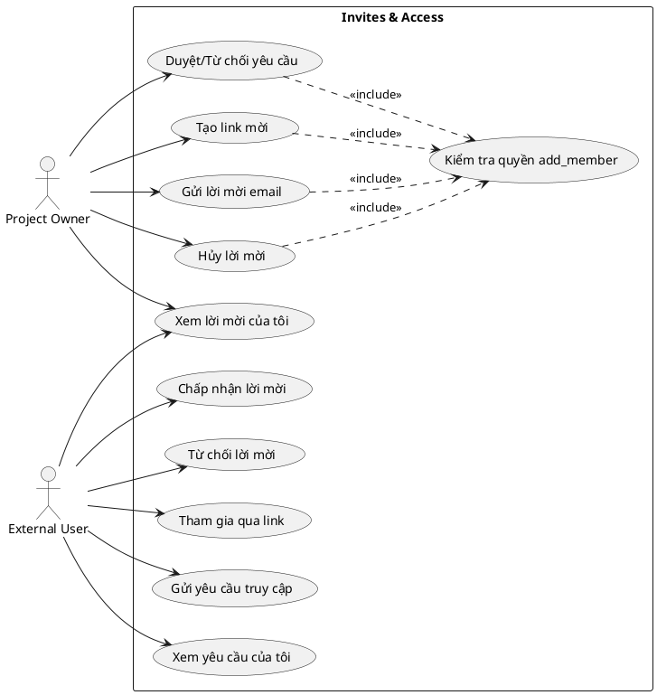

### Sequence Diagram – Send Invite via Email
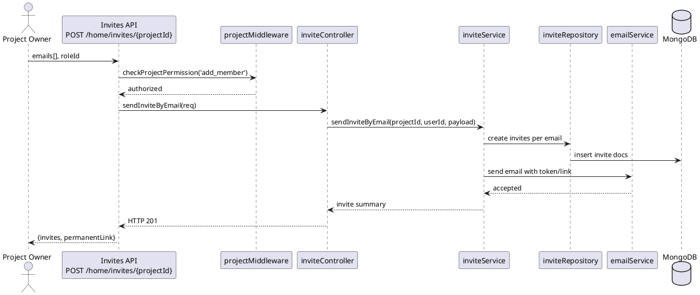

---

## 5. Notification System
**Scope:** Lấy danh sách thông báo, xem chi tiết, đánh dấu đã đọc và xóa (`src/routes/home/notificationRoute.js`).

**Key Endpoints:**
- `GET /home/noti`, `GET /home/noti/{id}`
- `PATCH /home/noti/{id}` (mark as read)
- `DELETE /home/noti/{id}`, `DELETE /home/noti` (xóa hàng loạt)

### Use Case Diagram
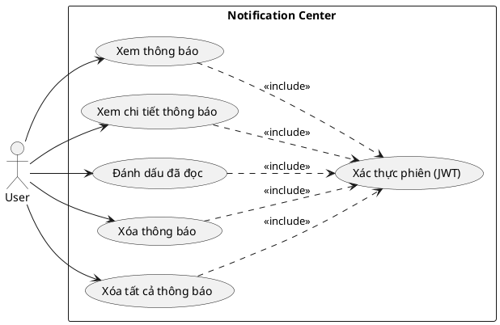

### Sequence Diagram – Mark Notification as Read
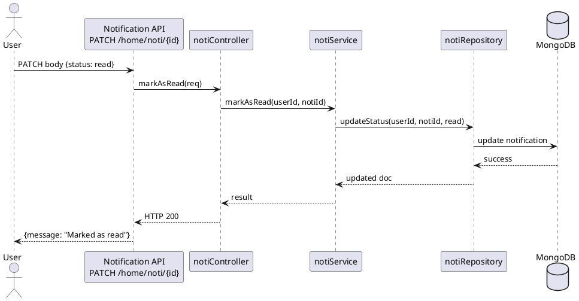

---

## 6. Search & Dashboard Insights
**Scope:** Dashboard thống kê, danh sách project gần đây và tìm kiếm toàn cục bằng MeiliSearch (`src/routes/home/dashboardRoute.js`, `src/routes/home/searchRoute.js`).

**Key Endpoints:**
- Dashboard: `GET /home/dashboards`, `GET /home/dashboards/projects/recent`
- Search: `GET /home/search`, `GET /home/search/projects`, `GET /home/search/tasks`, `GET /home/search/users`

### Use Case Diagram
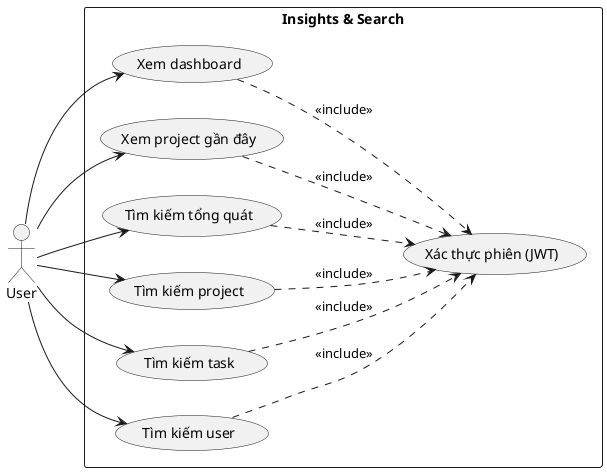

### Sequence Diagram – Global Search
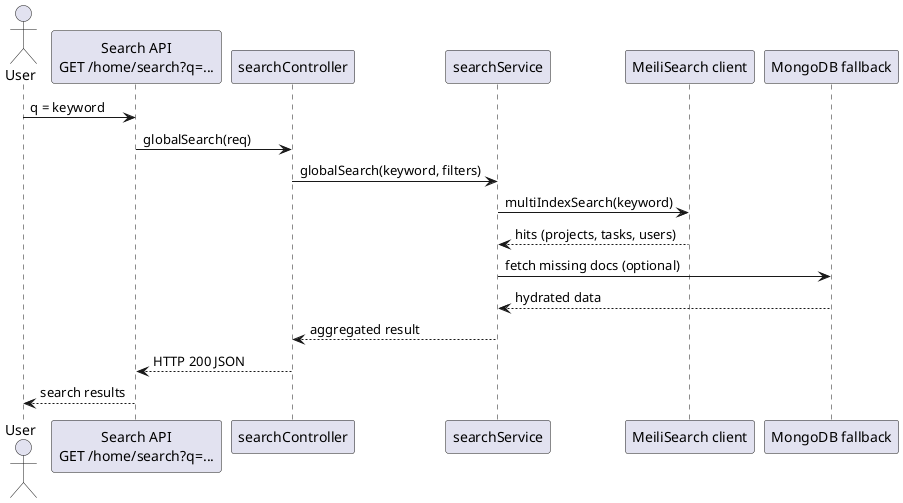

---

*PlantUML có thể được render trực tiếp thông qua bất kỳ PlantUML server nào hoặc VS Code PlantUML extension để kiểm chứng luồng hoạt động.*
