# IT Task Manager – UML Pack
_Date: 2025-12-03_

Actors in scope:
- **Owner** – dự án admin, toàn quyền.
- **Member** – thành viên thông thường trong dự án.

Chỉ cung cấp 10 biểu đồ được yêu cầu, theo đúng phạm vi backend hiện tại.

---

## 1. Biểu đồ Use Case tổng quát hệ thống
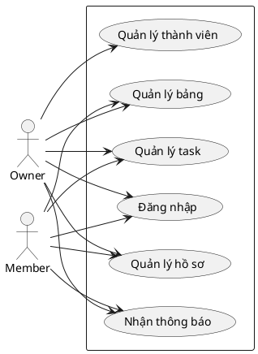

---

## 2. Biểu đồ use case đăng nhập
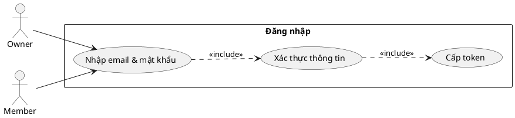

---

## 3. Biểu đồ trình tự đăng nhập
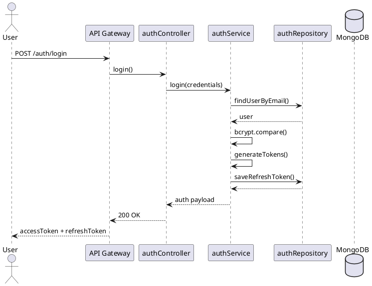

---

## 4. Biểu đồ use case quản lý thông tin cá nhân
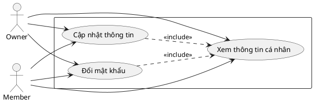

---

## 5. Biểu đồ trình tự quản lý thông tin cá nhân
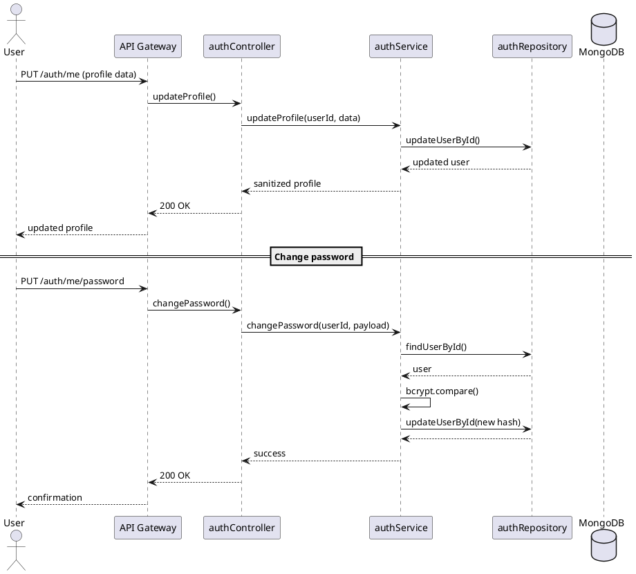

---

## 6. Biểu đồ use case quản lý thành viên
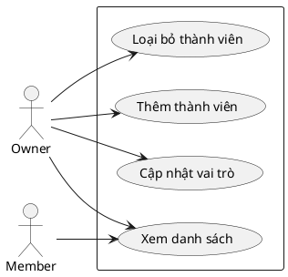

---

## 7. Biểu đồ trình tự quản lý thành viên
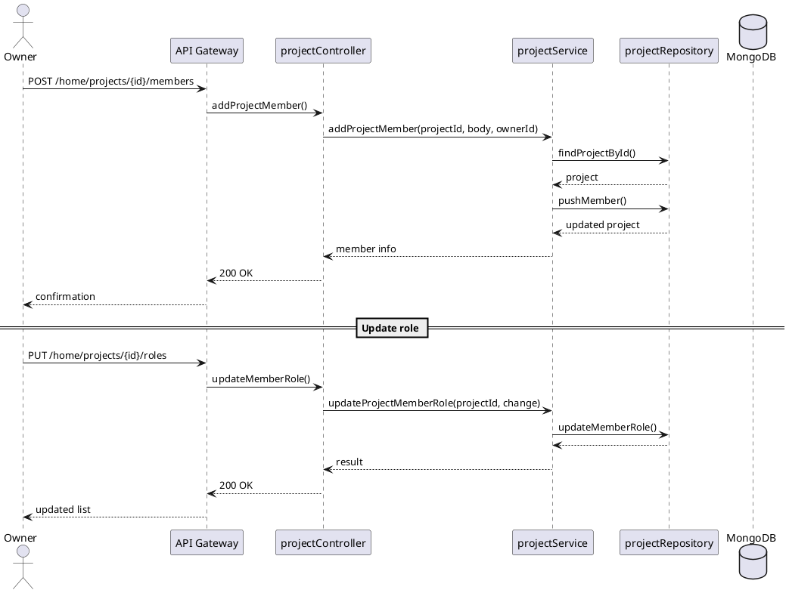

---

## 8. Biểu đồ use case quản lý bảng
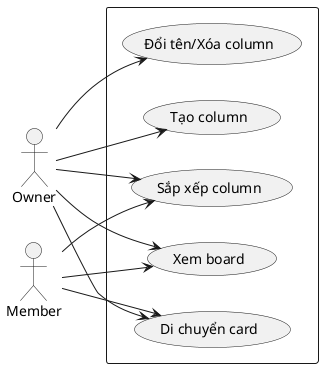

---

## 9. Biểu đồ trình tự quản lý bảng
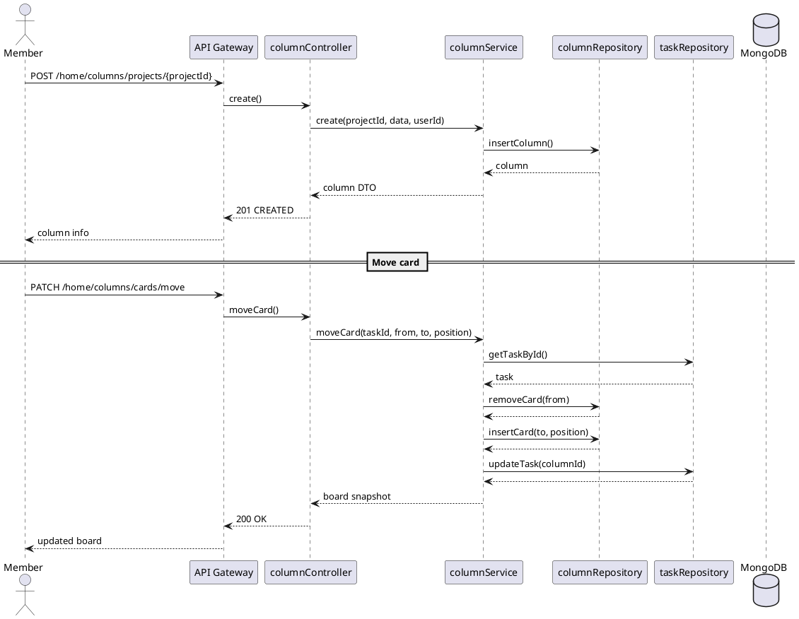

---

## 10. Biểu đồ use case quản lý task
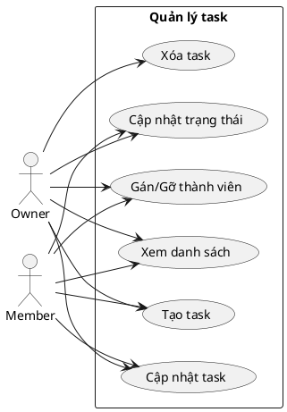

---

## 11. Biểu đồ trình tự quản lý task
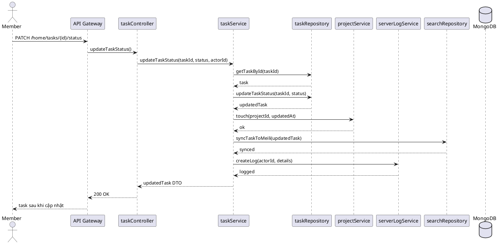

---

## 12. Biểu đồ lớp tổng quát hệ thống
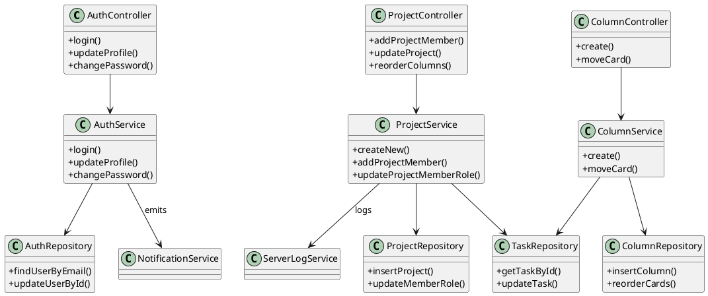

---

## Đặc tả Use Case
Ngôn ngữ trình bày thống nhất theo mẫu đã cung cấp. Mỗi use case phía dưới đều mô tả Tác nhân, bối cảnh, dòng sự kiện chính và kết quả.

### 1. Đặc tả use case Đăng nhập
- **Tác nhân**: Owner, Member.
- **Mô tả**: Khi tác nhân cần sử dụng hệ thống, họ phải đăng nhập bằng tài khoản đã được cấp. Sau khi hoàn thành công việc có thể đăng xuất khỏi hệ thống.
- **Dòng sự kiện chính**:
	1. Tác nhân yêu cầu giao diện đăng nhập.
	2. Hệ thống hiển thị form nhập email và mật khẩu.
	3. Tác nhân nhập thông tin đăng nhập và gửi yêu cầu.
	4. Hệ thống kiểm tra dữ liệu, đối chiếu với cơ sở dữ liệu và xác nhận.
	5. Nếu hợp lệ, hệ thống phát hành access token/refresh token, thông báo thành công và chuyển tác nhân vào giao diện chính.
	6. Nếu không hợp lệ, hệ thống thông báo "Bạn đã đăng nhập sai tên tài khoản hoặc mật khẩu" và giữ tác nhân ở màn hình đăng nhập để nhập lại.

### 2. Đặc tả use case Quản lý hồ sơ
- **Tác nhân**: Owner, Member.
- **Mô tả**: Tác nhân xem và cập nhật thông tin cá nhân (họ tên, avatar, thông tin liên hệ) cũng như thay đổi mật khẩu khi cần.
- **Dòng sự kiện chính**:
	1. Tác nhân chọn chức năng "Hồ sơ của tôi".
	2. Hệ thống tải dữ liệu hồ sơ hiện tại và hiển thị trên giao diện.
	3. Tác nhân chỉnh sửa trường cần thay đổi và gửi yêu cầu lưu.
	4. Hệ thống xác thực token, kiểm tra định dạng dữ liệu, cập nhật vào DB.
	5. Hệ thống trả về thông báo "Cập nhật hồ sơ thành công" cùng dữ liệu mới.
	6. Nếu tác nhân chọn đổi mật khẩu, hệ thống yêu cầu mật khẩu hiện tại để xác minh trước khi lưu mật khẩu mới.

### 3. Đặc tả use case Quản lý thành viên
- **Tác nhân**: Owner (chủ dự án). Member chỉ có quyền xem danh sách.
- **Mô tả**: Owner quản lý danh sách thành viên của dự án (thêm, cập nhật vai trò, loại bỏ). Member chỉ được xem thông tin để phối hợp.
- **Dòng sự kiện chính**:
	1. Owner mở trang "Thành viên" của dự án.
	2. Hệ thống liệt kê danh sách hiện tại kèm vai trò.
	3. Owner chọn hành động: thêm thành viên (qua email hoặc ID), đổi vai trò, hay loại bỏ.
	4. Hệ thống xác thực quyền `add_member`/`update_role`/`remove_member` tương ứng.
	5. Hệ thống cập nhật DB, ghi log hoạt động và gửi thông báo liên quan.
	6. Hệ thống trả kết quả cho Owner; Member được thấy danh sách đã cập nhật ở lần tải tiếp theo.

### 4. Đặc tả use case Quản lý bảng
- **Tác nhân**: Owner, Member.
- **Mô tả**: Tác nhân thao tác trực quan trên board Kanban của dự án: tạo column, đổi tên, xóa, sắp xếp thứ tự và kéo thả card.
- **Dòng sự kiện chính**:
	1. Tác nhân mở board của dự án.
	2. Hệ thống tải danh sách column và card theo thứ tự hiện tại.
	3. Tác nhân chọn hành động: thêm column mới, đổi tên, xóa, hay kéo thả card giữa các column.
	4. Hệ thống xác thực quyền can thiệp board, kiểm tra dữ liệu và cập nhật column/card tương ứng.
	5. Hệ thống đồng bộ lại thứ tự, phản hồi realtime cho tác nhân và lưu thay đổi xuống cơ sở dữ liệu.
	6. Kết thúc khi mọi thay đổi đã hiển thị trên giao diện board mới.

### 5. Đặc tả use case Quản lý task
- **Tác nhân**: Owner, Member.
- **Mô tả**: Tác nhân tạo, chỉnh sửa, gán người thực hiện, cập nhật trạng thái hoặc xóa task trong phạm vi dự án của họ.
- **Dòng sự kiện chính**:
	1. Tác nhân vào module task của một dự án.
	2. Hệ thống hiển thị danh sách task kèm bộ lọc.
	3. Tác nhân thực hiện hành động (tạo mới, sửa nội dung, gán thành viên, đổi trạng thái, xóa).
	4. Hệ thống kiểm tra quyền thao tác (ví dụ phải là người tạo hoặc có vai trò phù hợp), xác thực dữ liệu nhập.
	5. Sau khi lưu DB, hệ thống đồng bộ MeiliSearch, cập nhật log hoạt động và trả về thông báo "Thao tác với task thành công".
	6. Nếu có lỗi (thiếu quyền, dữ liệu sai), hệ thống phản hồi thông báo lỗi chi tiết và yêu cầu tác nhân điều chỉnh.

### 6. Đặc tả use case Nhận thông báo
- **Tác nhân**: Owner, Member.
- **Mô tả**: Tác nhân xem danh sách thông báo, đọc chi tiết, đánh dấu đã đọc hoặc xóa các thông báo trong hộp thư của mình.
- **Dòng sự kiện chính**:
	1. Tác nhân mở mục "Thông báo".
	2. Hệ thống truy vấn các thông báo chưa/đã đọc và hiển thị danh sách mới nhất.
	3. Tác nhân chọn một thông báo để xem chi tiết hoặc đánh dấu đã đọc hàng loạt.
	4. Hệ thống cập nhật trạng thái đọc trong DB.
	5. Nếu tác nhân chọn xóa, hệ thống sẽ gỡ thông báo khỏi danh sách của người dùng và phản hồi "Xóa thông báo thành công".
	6. Trường hợp không có thông báo, hệ thống hiển thị lời nhắc "Bạn đã xem hết thông báo".

	---

	## Tài liệu tham khảo

